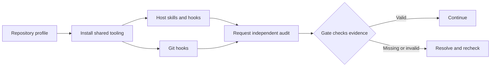

# BoxLite Agent Tooling

## TL;DR

Shared skills, independent audits, and repository gates that help coding agents carry work from design through review across BoxLite repositories.

[Get started](#get-started) · [Add to a repository](#add-to-a-repository) · [Architecture](plugins/boxlite-agent-tooling/ARCHITECTURE.md) · [Contributing](plugins/boxlite-agent-tooling/CONTRIBUTING.md)

## Why use it?

A repository can tell an agent how to work. This toolkit also checks key actions against that workflow: editing, committing, pushing, publishing a PR, and reporting completion.

| You want… | The toolkit provides… |
| --- | --- |
| Consistent engineering practices across repositories | Shared guidance installed into `AGENTS.md`, plus reusable skills |
| Evidence behind an agent's conclusions | Independent auditors for completion claims and commit/push readiness |
| Reviewable changes | Design-document checks, PR size checks, and human review acknowledgments |
| Feedback after a push | A PR watcher for checks, reviews, comments, and merge conflicts |
| Repository-specific verification | A small profile declaring the checks each project needs |

Built for Claude Code and Codex. Copilot has a marketplace entry and generic manifest, but installation on a real host remains untested.

## How it works



The **host plugin** supplies skills, auditors, and lifecycle hooks. The **repository installer** configures Git hooks and shared instructions. Both are needed for the complete workflow; installing a host plugin alone does not configure a repository.

An auditor produces evidence bound to the work it reviewed. Gates read that evidence. For example, changing the staged diff after an audit invalidates its commit approval and requires another audit.

These are local workflow checks, not a sandbox or a GitHub security boundary. Git audit gates activate in agent-marked environments; browser writes and other unsupported routes fall outside CLI checks. See [enforcement boundaries](plugins/boxlite-agent-tooling/ARCHITECTURE.md#boundaries).

## Get started

**Already in a configured repository?** From its root, run:

```sh
./.agent-tooling/install.sh
```

You need Bash, Git, `jq`, Perl, and the CLI for your host. GitHub operations require authenticated `gh`; declared project checks may need additional tools. First installation needs network access.

| Host | Activate after repository setup |
| --- | --- |
| Claude Code | Trust the repository and its bootstrap hooks. After installation, run `/reload-plugins` or start a new session. |
| Codex | Trust the project `SessionStart` hook, then restart or resume. After installation, start a new task and review plugin hooks with `/hooks`. |
| Copilot | Activation files are supplied; end-to-end installation is unverified. |

The installer updates the managed guidance in `AGENTS.md` and the `CLAUDE.md` import. Review those changes before committing. Background refreshes leave committed instructions alone.

## Add to a repository

A *consumer* is a Git repository that uses this toolkit. Clone this source repository to obtain the files below, then add them to your consumer. Merge settings and hooks where files already exist.

### 1. Declare the project

Create `.agent-tooling/profile.json`. Replace the example repository and test command with your own:

```json
{
  "schemaVersion": 1,
  "profile": "my-project",
  "repository": "your-org/your-repo",
  "tooling": {
    "repository": "boxlite-ai/agent-tooling",
    "ref": "main"
  },
  "checks": [
    { "name": "tests", "command": "npm test" }
  ]
}
```

`tooling.ref` names a branch. `checks` must contain at least one named command. The declared repository must match `origin` when one exists; profiles contain configuration, never credentials.

Add these runtime paths to the consumer's `.gitignore`:

```gitignore
.agents/state/
.claude/.last-audit.json
.claude/.last-audit-handoff.json
.claude/.last-verdict.json
.claude/.pr-reviewed.json
.claude/.verdict-last-uuid
.claude/.verdict-decisions.log
```

### 2. Add installation and activation files

Paths in the first column are relative to this source checkout; destinations are relative to the consumer root.

| Source | Consumer destination |
| --- | --- |
| [Installer](templates/install.sh) | `.agent-tooling/install.sh` |
| [Codex marketplace](.agents/plugins/marketplace.json) | `.agents/plugins/marketplace.json` |
| [Claude bootstrap script](templates/claude-plugin-bootstrap.sh) | `.agent-tooling/claude-plugin-bootstrap.sh` |
| [Claude bootstrap settings](templates/claude-plugin-bootstrap.json) | Merge into `.claude/settings.json` |
| [Codex bootstrap script](templates/codex-plugin-bootstrap.sh) | `.agent-tooling/codex-plugin-bootstrap.sh` |
| [Codex bootstrap hook](templates/codex-plugin-bootstrap.json) | Merge into `.codex/hooks.json` |
| [Copilot activation settings](.github/copilot/settings.json) | Merge into `.github/copilot/settings.json` |

The profile validator currently requires activation declarations for all three hosts, even if you use only one. Keep their marketplace refs aligned with `tooling.ref`. Use the canonical Git marketplace source from the templates; local clone registrations conflict across worktrees.

For existing Claude settings, use the supplied merge helper from this checkout, with `consumer` set to the destination repository:

```sh
consumer=/absolute/path/to/your-repo
jq -s -f templates/merge-claude-plugin-settings.jq \
  "$consumer/.claude/settings.json" templates/claude-plugin-bootstrap.json \
  > "$consumer/.claude/settings.json.new" &&
  mv "$consumer/.claude/settings.json.new" "$consumer/.claude/settings.json"
```

For a new settings file, copy the template directly. For existing Codex hooks, append the template's `SessionStart` entry while preserving unrelated hooks.

### 3. Install and activate

From the consumer root:

```sh
chmod +x .agent-tooling/install.sh \
  .agent-tooling/claude-plugin-bootstrap.sh \
  .agent-tooling/codex-plugin-bootstrap.sh
./.agent-tooling/install.sh
git config --worktree --get core.hooksPath
```

The hook path should point into the adopted tooling checkout. Setup assigns the worktree's `core.hooksPath`; inspect existing hook integration before adoption. Commit the consumer files and generated instructions, then activate your host as described above.

## Work with the toolkit

Ask your agent to work normally. Hooks check supported actions as they happen and explain what is needed when a gate blocks progress.

| Task | Entry point |
| --- | --- |
| Implement, refactor, or review maintainability | [boxlite-clean-code](plugins/boxlite-agent-tooling/.agents/skills/boxlite-clean-code/SKILL.md) |
| Shorten a reply, document, or PR description | [boxlite-writing](plugins/boxlite-agent-tooling/.agents/skills/boxlite-writing/SKILL.md) |
| Explain a subsystem with a concrete example | “Use `boxlite-examples` to explain how this subsystem works.” |
| Draw a diagram grounded in source | [boxlite-visualize](plugins/boxlite-agent-tooling/.agents/skills/boxlite-visualize/SKILL.md) |
| Implement a Bash hook or gate | [shell-engineering](plugins/boxlite-agent-tooling/.agents/skills/shell-engineering/SKILL.md) |
| Iterate on design-review findings | [adversarial-iteration](plugins/boxlite-agent-tooling/.agents/skills/adversarial-iteration/SKILL.md) |
| Register a design before implementation | [Design registration](plugins/boxlite-agent-tooling/CONTRIBUTING.md#pull-request-descriptions) |
| Prepare a PR for human review | [Author acknowledgment](plugins/boxlite-agent-tooling/CONTRIBUTING.md#author-review-acknowledgment) |

Workflow and writing reminders reference `boxlite-writing` by name; the host loads
its instructions. Try: "Use boxlite-writing to shorten this PR description."

After a push, the Git hook starts the PR watcher; the agent attaches to its event stream. Idle delivery needs host support: a Codex heartbeat or Claude Monitor. See the [watch lifecycle](plugins/boxlite-agent-tooling/.agents/watch/consumer-lifecycle.md).

For unattended Claude runs, the [network-recovery wrapper](plugins/boxlite-agent-tooling/scripts/resume-on-network-error.sh) retries recorded transient failures within bounded budgets. It requires `claude`, `jq`, `curl`, the failure-recording hook, and a matching `CLAUDE_PROJECT_DIR`.

### BoxLite Clean Code skill

Use `boxlite-clean-code` to connect concrete maintainability problems to small changes
while preserving contracts, resource ownership, and repository conventions.
Try: "Use boxlite-clean-code to review this module's error handling without editing it."

The plugin exposes the skill through its existing shared skills directory.
For standalone sharing, copy the entire `boxlite-clean-code` directory into a skill
location supported by your agent, including its `references/` directory. The short
entry point links practical decision criteria and refactoring cases.
There are no helper scripts or plugin dependencies. Repository workflow rules
remain in `AGENTS.md`; the skill supplies focused engineering guidance.

### Optional prompt reminders

For prompt-only reminders, copy [rule-recency.sh](plugins/boxlite-agent-tooling/.agents/hooks/rule-recency.sh)
to the consumer's `.agent-tooling/` directory and use the [Codex](templates/codex-hooks.json)
or [Claude](templates/claude-settings.json) template. The host must discover
`boxlite-writing`; the copied hook references its name without embedding its rules.
Set `consumer` to the destination repository before running the recipe below.

Claude Code needs a **merge**, not a copy — `.claude/settings.json` also carries keys
such as `env`, and overwriting it would drop them:

```sh
mkdir -p "$consumer/.claude"
if [ -f "$consumer/.claude/settings.json" ]; then
  jq -s '
    .[0] as $current | .[1] as $rules |
    ($current * $rules) |
    .hooks.UserPromptSubmit = (
      reduce (
        (($current.hooks.UserPromptSubmit // []) +
         ($rules.hooks.UserPromptSubmit // []))[]
      ) as $entry
        ([]; if index($entry) == null then . + [$entry] else . end)
    )
  ' "$consumer/.claude/settings.json" templates/claude-settings.json \
    > "$consumer/.claude/settings.json.new" &&
    mv "$consumer/.claude/settings.json.new" "$consumer/.claude/settings.json"
else
  cp templates/claude-settings.json "$consumer/.claude/settings.json"
fi
```

## Updates and troubleshooting

Consumers follow the branch in `tooling.ref`. The installer validates a fetched revision before recording it as adopted; offline verification uses that recorded cache. Host plugins refresh separately, so an adopted Git-hook revision does not prove a running session has reloaded.

| Need | Action |
| --- | --- |
| Refresh tooling and shared instructions | Run `./.agent-tooling/install.sh` explicitly. |
| Inspect the adopted revision | Read `agent-tooling/current` under `git rev-parse --git-common-dir`; `agent-tooling/history.log` records adoptions. |
| Pause background polling | Set `AGENT_TOOLING_REFRESH=0`; `AGENT_TOOLING_REFRESH_MINUTES` controls its interval. |
| Freeze repository tooling | Put one full lowercase commit SHA in `.agent-tooling/hold`, then run the installer. Remove it and reinstall to resume following the branch. |
| Repair missing or stale Git hooks | Rerun the installer; it can repair from an existing valid cache offline. |
| Load newly installed host resources | Reload Claude plugins or start a new Codex task; check hook trust. |
| Resolve a blocked action | Follow the gate's diagnostic; [architecture](plugins/boxlite-agent-tooling/ARCHITECTURE.md#entry-points) maps each gate to its evidence and recovery path. |

A hold constrains repository tooling; it does not silently roll back host plugins. A mismatched host-plugin version fails bootstrap. Consumer installer and bootstrap scripts are committed copies: refresh them from `templates/` when adopting fixes to those scripts.

## Develop and contribute

Reusable implementation lives in [`plugins/boxlite-agent-tooling/`](plugins/boxlite-agent-tooling/). Consumer bootstrap files live in [`templates/`](templates/). Start with the [contributor guide](plugins/boxlite-agent-tooling/CONTRIBUTING.md) and [architecture map](plugins/boxlite-agent-tooling/ARCHITECTURE.md#code-map).

Run these repository checks, then the focused tests for the area you changed:

```sh
bash plugins/boxlite-agent-tooling/scripts/check-writing-ownership.sh .
bash plugins/boxlite-agent-tooling/host-parity.test.sh
bash plugins/boxlite-agent-tooling/architecture.test.sh
```

The optional [GitHub author-review workflow](.github/workflows/author-review.yml) enforces acknowledgments on PRs. Adopt it separately using a reviewed, immutable tooling revision, then require `Author reviewed the PR` in branch rules. Never run PR-head code in that privileged workflow.

## License

[Apache 2.0](LICENSE).
