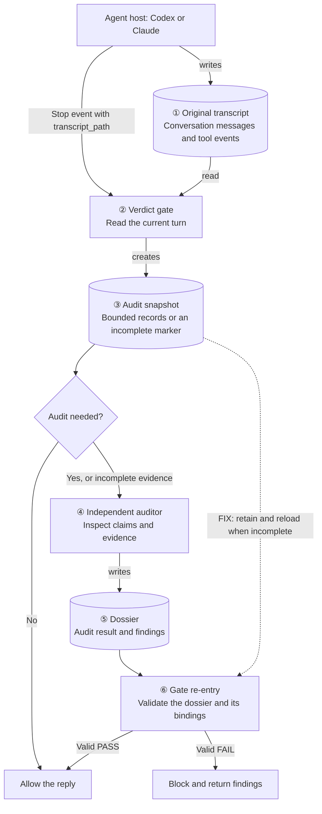

## TL;DR

The original transcript records the conversation, the snapshot supplies audit input, and the dossier records the auditor's decision.

## End-to-end flow

**Snapshot and dossier are separate files:**

| Concept | Created by | Meaning |
|---|---|---|
| **Original transcript** | Agent host | What happened during the conversation |
| **Snapshot** | Gate | What evidence the auditor receives |
| **Incomplete snapshot** | Gate | Evidence could not be captured completely |
| **Dossier** | Auditor | Its assessment: PASS, FAIL, or IN_PROGRESS, with findings |

The runner gives the auditor a [private copy of the snapshot](run-verdict-audit.sh#L709).
Re-entry means running the gate again to validate the returned dossier against the
current session, audit generation, and repository state.

## Where the fix applies

The regression test follows this sequence:

1. The **65 MiB original transcript** exceeds the reader's limit.
2. The gate saves an **incomplete snapshot** containing `truncated: true` and `records: []`.
3. The test deletes the **original transcript**.
4. The fix preserves the snapshot through retries and reloads it during **gate re-entry**.
5. The auditor's instructions require a **FAIL dossier** for that incomplete marker,
   which the gate uses to block. [Auditor rule](../../.claude/agents/verdict-auditor.md#L24)

Previously, step 4 could reopen the deleted original, conclude "nothing to judge,"
and allow **before checking the dossier**.
