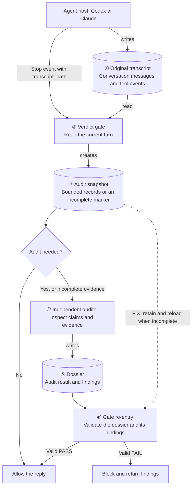

## TL;DR

The original transcript records the conversation, the snapshot supplies audit input, and the dossier records the auditor's decision.

## End-to-end flow

Registered hook entry points stay in this directory. Supporting files are grouped
by purpose:

| Directory | Responsibility |
| --- | --- |
| `audit/` | Audit runners, verdict checker, schema, and audit tests |
| `design/` | Design-document preflight tests |
| `pr/` | PR publication tests and rendering fixtures |
| `resume/` | API failure and recovery tests |
| `session/` | Stop and standalone-reminder tests |
| `watch/` | Remote-write watcher tests |

Host manifests keep their existing paths. Scripts resolve grouped helpers and
shared libraries from the plugin root. Keep fixture copies at the same depth.
Copy the standalone reminder and its Markdown companion together when installing
it outside the plugin.

```mermaid
flowchart TD
    H["Agent host: Codex or Claude"]
    T[("① Original transcript<br/>Conversation messages and tool events")]
    G["② Verdict gate<br/>Read the current turn"]
    S[("③ Audit snapshot<br/>Bounded records or an incomplete marker")]
    Q{"Audit needed?"}
    A["④ Independent auditor<br/>Inspect claims and evidence"]
    D[("⑤ Dossier<br/>Audit result and findings")]
    V["⑥ Gate re-entry<br/>Validate the dossier and its bindings"]
    OK["Allow the reply"]
    BLOCK["Block and return findings"]

    H -->|writes| T
    H -->|Stop event with transcript_path| G
    T -->|read| G
    G -->|creates| S
    S --> Q
    Q -->|No| OK
    Q -->|Yes, or incomplete evidence| A
    A -->|writes| D
    D --> V
    S -.->|FIX: retain and reload when incomplete| V
    V -->|Valid PASS| OK
    V -->|Valid FAIL| BLOCK
```

**Snapshot and dossier are separate files:**

| Concept | Created by | Meaning |
|---|---|---|
| **Original transcript** | Agent host | What happened during the conversation |
| **Snapshot** | Gate | What evidence the auditor receives |
| **Incomplete snapshot** | Gate | Evidence could not be captured completely |
| **Dossier** | Auditor | Its assessment: PASS, FAIL, or IN_PROGRESS, with findings |

The runner gives the auditor a [private copy of the snapshot](audit/run-verdict-audit.sh).
Re-entry means running the gate again to validate the returned dossier against the
current session, audit generation, and repository state.

## Where the fix applies

The regression test follows this sequence:

1. The **65 MiB original transcript** exceeds the reader's limit.
2. The gate saves an **incomplete snapshot** containing `truncated: true` and `records: []`.
3. The test deletes the **original transcript**.
4. The fix preserves the snapshot through retries and reloads it during **gate re-entry**.
5. The auditor's instructions require a **FAIL dossier** for that incomplete marker,
   which the gate uses to block. [Auditor rule](../../.claude/agents/verdict-auditor.md#L24)

Previously, step 4 could reopen the deleted original, conclude "nothing to judge,"
and allow **before checking the dossier**.
