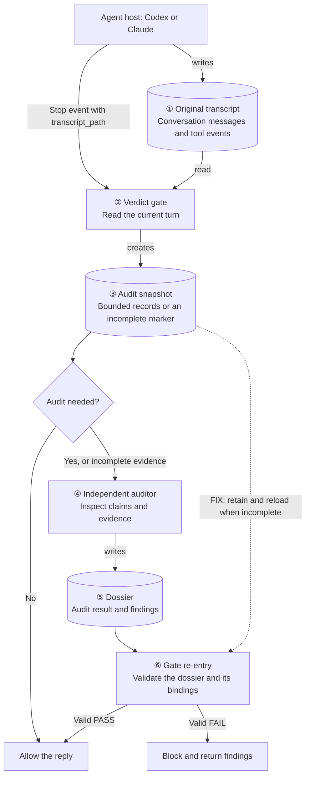

## TL;DR

These scripts implement host lifecycle checks and audit runners; the manifests select when each hook runs.

## Entry points

See [host wiring](../../hooks/README.md) for events and host differences,
[Git hooks](../../.githooks/README.md) for commit/push enforcement, and
[architecture](../../ARCHITECTURE.md#entry-points) for full contracts.

| Script | Caller / input | Responsibility |
| --- | --- | --- |
| [cancel-verdict-audit.sh](cancel-verdict-audit.sh) | `UserPromptSubmit` JSON | Revoke this session's abandoned audit; its runner owns process cancellation. |
| [auditor-control.sh](auditor-control.sh) | `SubagentStart` / `SubagentStop` JSON | Track auditor escalation, completion, and prompt-scoped user overrides. |
| [preflight-design-doc.sh](preflight-design-doc.sh) | Editor/patch `PreToolUse` JSON | Require a readable, current design binding for repository edits. |
| [preflight-commit-push.sh](preflight-commit-push.sh) | Shell `PreToolUse` or delegated Git payload | Require matching commit/push evidence; delegate to installed Git gates. |
| [preflight-pr-review.sh](preflight-pr-review.sh) | Shell `PreToolUse` JSON | Inspect GitHub writing and PR design, explanation, size, and review acknowledgment. |
| [claude-timed-question.sh](claude-timed-question.sh) | Claude `AskUserQuestion` pre/post JSON | Validate a managed question and capture the user's timely typed response. |
| [post-remote-write-watch.sh](post-remote-write-watch.sh) | Shell `PostToolUse` JSON | Connect successful remote writes and pending events to the host's watch consumer. |
| [stop-gate.sh](stop-gate.sh) | `Stop` JSON | Sequence timed confirmations, writing checks, and verdict validation. |
| [preflight-verdict-check.sh](audit/preflight-verdict-check.sh) | Stop payload forwarded by `stop-gate.sh` | Inspect the whole final turn and validate a dossier or request an independent audit. |
| [run-verdict-audit.sh](audit/run-verdict-audit.sh) | `<transcript_path> [session_id] [generation] [session_scope]` | Run an independent model CLI and publish the validated turn dossier. |
| [run-commit-push-audit.sh](audit/run-commit-push-audit.sh) | `<commit\|push> <command>` | Produce a commit/push dossier for callers without a native agent runtime. |
| [record-api-failure.sh](record-api-failure.sh) | Claude `StopFailure` JSON | Best-effort failure-kind recording for the unattended recovery wrapper. |
| [resume-after-api-failure.sh](resume-after-api-failure.sh) | Claude `StopFailure` JSON | Request a bounded interactive resume through `asyncRewake` for eligible failures. |
| [rule-recency.sh](rule-recency.sh) | Opt-in `UserPromptSubmit` JSON | Emit a workflow/skill reminder for substantive prompts; always exit successfully. |

Host callbacks read JSON on stdin; runners take positional arguments. A hook's
output and exit status follow its host event contract, so do not apply one exit-code
rule to every script. Shared state and parsing live in [`../lib/`](../lib/).

Gates consume evidence; auditors produce it. The commit/push dossier shape is in
[commit-push-audit.schema.json](audit/commit-push-audit.schema.json), and the verdict
procedure is in the [auditor spec](../../.claude/agents/verdict-auditor.md).
Runtime files live under the consumer's ignored `.agents/state/` directory.

## Tests

Run adjacent suites from the repository root, for example:

```sh
bash plugins/boxlite-agent-tooling/.agents/hooks/design/preflight-design-doc.test.sh
bash plugins/boxlite-agent-tooling/.agents/hooks/session/stop-gate.test.sh
```

Additional suites cover GitHub writing, PR design/explanations/size, TL;DR checks,
auditor overrides, and watch delivery. Managed questions also use
[`scripts/claude-timed-prompts.test.sh`](../../scripts/claude-timed-prompts.test.sh).
`pr/fixtures/` holds recorded test inputs.

## How it works

On `Stop`, `stop-gate.sh` checks pending confirmations and writing requirements,
then passes the payload to `preflight-verdict-check.sh`. The verdict gate captures
the final turn, checks existing evidence, and runs an independent auditor when
needed. A matching result determines whether the reply can finish.

The original transcript records the conversation, the snapshot supplies audit input,
and the dossier records the auditor's decision.

Registered hook entry points stay in this directory. Supporting files are grouped
by purpose:

| Directory | Responsibility |
| --- | --- |
| `audit/` | Audit runners, verdict checker, schema, and audit tests |
| `design/` | Design-document preflight tests |
| `pr/` | PR publication tests and rendering fixtures |
| `resume/` | API failure and recovery tests |
| `session/` | Stop and standalone-reminder tests |
| `watch/` | Remote-write watcher tests |

Host manifests keep their existing paths. Scripts resolve grouped helpers and
shared libraries from the plugin root. Keep fixture copies at the same depth.
Copy the standalone reminder and its Markdown companion together when installing
it outside the plugin.


```mermaid
flowchart TD
    H["Agent host: Codex or Claude"]
    T[("① Original transcript<br/>Conversation messages and tool events")]
    G["② Verdict gate<br/>Read the current turn"]
    S[("③ Audit snapshot<br/>Bounded records or an incomplete marker")]
    Q{"Audit needed?"}
    A["④ Independent auditor<br/>Inspect claims and evidence"]
    D[("⑤ Dossier<br/>Audit result and findings")]
    V["⑥ Gate re-entry<br/>Validate the dossier and its bindings"]
    OK["Allow the reply"]
    BLOCK["Block and return findings"]

    H -->|writes| T
    H -->|Stop event with transcript_path| G
    T -->|read| G
    G -->|creates| S
    S --> Q
    Q -->|No| OK
    Q -->|Yes, or incomplete evidence| A
    A -->|writes| D
    D --> V
    S -.->|FIX: retain and reload when incomplete| V
    V -->|Valid PASS| OK
    V -->|Valid FAIL| BLOCK
```

**Snapshot and dossier are separate files:**

| Concept | Created by | Meaning |
|---|---|---|
| **Original transcript** | Agent host | What happened during the conversation |
| **Snapshot** | Gate | What evidence the auditor receives |
| **Incomplete snapshot** | Gate | Evidence could not be captured completely |
| **Dossier** | Auditor | Its assessment: PASS, FAIL, or IN_PROGRESS, with findings |

The runner gives the auditor a [private copy of the snapshot](audit/run-verdict-audit.sh).
Re-entry means running the gate again to validate the returned dossier against the
current session, audit generation, and repository state.

## Where the fix applies

The regression test follows this sequence:

1. The **65 MiB original transcript** exceeds the reader's limit.
2. The gate saves an **incomplete snapshot** containing `truncated: true` and `records: []`.
3. The test deletes the **original transcript**.
4. The fix preserves the snapshot through retries and reloads it during **gate re-entry**.
5. The auditor's instructions require a **FAIL dossier** for that incomplete marker,
   which the gate uses to block. [Auditor rule](../../.claude/agents/verdict-auditor.md#L24)

Previously, step 4 could reopen the deleted original, conclude "nothing to judge,"
and allow **before checking the dossier**.
