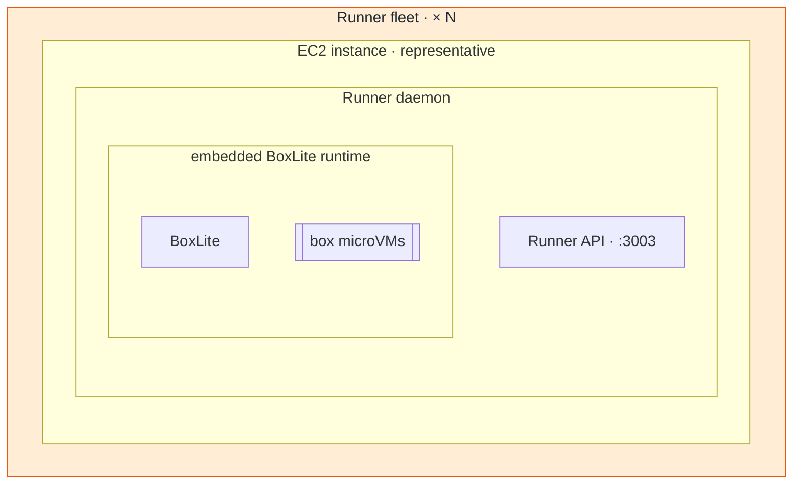

# Architecture composition

For architecture, deployment, topology, overview, or rendered-picture work.

## Baseline

Hosted cloud: start from
[`apps/infra/docs/deployment.md#architecture`](../../../../apps/infra/docs/deployment.md#architecture).
Reuse its layout, but treat its containment as a hypothesis and re-verify every boundary
against current IaC and source. Never rebuild the system from call paths because more
source exists. If it predates the palette, keep its composition and add zones and colors.

## One altitude

Write the diagram's question in one sentence first — "How public traffic reaches private
BoxLite services and boxes". Every node must serve it. A deployment overview names
systems and boundaries, never functions; a call graph names functions, never cloud
resources. A second altitude is a child topic, not a second diagram at the same level.

"Entire deployment" means complete at one altitude, not every resource: user/SDK entry
points; external identity, DNS, registry, and telemetry on the main path; public ingress;
the network, host, process, and trust boundaries that explain ownership; compute and the
box execution boundary; durable state and caches; the main control, data, image, and
telemetry routes. Merge siblings that share boundary and role when their identity changes
no route.

## Containment before routes

- inside / runs on / owns / embeds → nested subgraph;
- calls / routes to / polls / mounts / exports → arrow;
- never an arrow for ownership, never an embedded component beside its host.

Every real boundary is a snake-case subgraph declared with its immediate members; the
validator checks the nesting, not the indentation. Hosted runner path — one
representative EC2 labelled `× N`, every step modelled:

The fleet is the execution zone and takes the color; EC2, process, and runtime are
physical and stay unstyled. This is the one place deep nesting earns its keep —
flattening it changes the meaning. Keep state, telemetry, and ingress grouping shallow.

## Hosted-cloud placement

Re-verify against IaC; these drift.

| Component | Where |
| --- | --- |
| browser, SDK/CLI, Cloudflare DNS, OIDC, image registry | outside BoxLite AWS |
| CloudFront | AWS global edge, outside the VPC |
| ALB/NLB | VPC public-ingress boundary |
| ECS/Fargate API, Proxy, internal tools | VPC private service boundary |
| Runner fleet | VPC public-runner subnet |
| RDS, Redis | VPC state boundary |
| regional S3 | outside the VPC; draw the gateway endpoint only when it matters |

A route category is not a boundary: "public edge" does not put its contents outside the
VPC.

## Scope zones

Mermaid has no "keep together" hint; zones make relatedness structural.

- Each node has exactly one scope — `external`, `edge`, `compute`, `execution`, `state`,
  `observability`. A scope's members form one subgraph; reuse a physical boundary that
  already matches (VPC state, runner fleet) rather than double-wrapping.
- Declare members on consecutive lines; order zones external → edge → compute →
  execution, with state and observability beside what they serve. Declaration order is
  the strongest layout lever, edge order the second.
- A zone split into islands is a failure — move members or reroute until contiguous.
- Declare each zone in `boundaries` with `scope`, so its class is checked, not trusted.
- Zones group; they never contradict a physical boundary.

## Fit a laptop screen

The validator rejects anything over **1600×900**. Node count does not predict fit:

| Shape | Nodes | Renders | |
| --- | --- | --- | --- |
| top-down chain | 20 | 148×1946 | too tall |
| fanned-out index | 12 | 1879×164 | too wide |
| zoned deployment | 16 | 1504×562 | fits |

Compose broad, shallow, and zoned. When the honest picture will not fit, raise the
altitude or split the topic — never shrink labels or drop real boundaries.

- `flowchart TB` for a deployment, `LR` for a short path; main path central.
- Sibling zones disjoint; no edge through a zone it does not touch; edges in main-path
  order.
- Short labels — a second line only for domain, port, protocol, implementation, scale,
  or constraint. Rounded actors, rectangle services, cylinder state, distinct microVMs.
- Leaf topic 12–20 nodes, index ≤12; boundaries that replace ownership arrows are free.
- No logos, icons, or legends. The render — not `direction` or indentation — is the
  truth.

## Palette

The only permitted styling; the validator rejects any other `classDef`, altered
definition, `style`, `linkStyle`, or theme.

| Scope | Meaning | Exact `classDef` |
| --- | --- | --- |
| `external` | users, SDKs, third parties | `classDef scope_external fill:#eceff1,stroke:#607d8b,color:#1f2933` |
| `edge` | public ingress and routing | `classDef scope_edge fill:#dbeafe,stroke:#2563eb,color:#1f2933` |
| `compute` | private services, internal tools | `classDef scope_compute fill:#dcfce7,stroke:#16a34a,color:#1f2933` |
| `execution` | runners and box execution | `classDef scope_execution fill:#ffedd5,stroke:#ea580c,color:#1f2933` |
| `state` | durable state and caches | `classDef scope_state fill:#ede9fe,stroke:#7c3aed,color:#1f2933` |
| `observability` | telemetry, logs, metrics | `classDef scope_observability fill:#fef3c7,stroke:#d97706,color:#1f2933` |

Copy the line verbatim and assign with `class <zone_id> scope_<name>`. Color zone
subgraphs only — nodes and physical boundaries stay plain so the distinction survives —
and the title still names the scope. Sequence and call graphs take no styling. Muted
fills with dark text stay legible on light/dark hosts; the live Mermaid is the source of
truth and the PNG a preview — check both themes when contrast matters.

## Visual QA

Open every PNG at fit-to-page:

1. scope stated in title or prose;
2. main path readable in seconds;
3. each parent visibly surrounds each declared member;
4. external / AWS / VPC / subnet / host / process / runtime / state / telemetry
   boundaries truthful and disjoint;
5. each scope one contiguous tinted zone; physical boundaries visibly plain;
6. labels legible and unclipped;
7. no arrow crosses an unrelated node or zone or implies false ownership;
8. no empty region or long return edge distorts the layout;
9. everything the scope sentence promised is present;
10. readable in light and dark.

Topic tree: every parent element promised detail has a child; no topic re-explains a
sibling; each child is one altitude below its parent. Syntax, evidence, and a viewport
pass are not a visual pass — revise and re-render on any failure.
