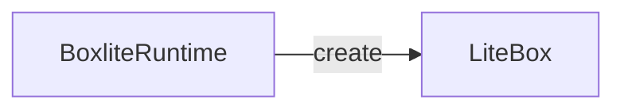

# Output contract

`evidence.schema.json` and the validator are the authority; this is the shape they accept.

## Views

`views`: non-empty subset of `architecture`, `sequence`, `call_graph`, in that order;
absent selects all three. Every item's `views` ⊆ selected views.

## Document

```text
## <View>            one H2 per selected view, canonical order
### <State label>    one H3 per manifest state, manifest order
<one fence>          mermaid (flowchart|graph …, sequenceDiagram) or text (call graph)
```

Bug-fix PR: `Fixes #<n>` on its own line after the last view.

## Topics

Declare the tree — `overview` is the root, every other topic names its `parent`, three
levels maximum:

```json
"topics": [
  {"id": "overview", "question": "How public traffic reaches boxes"},
  {"id": "runner_fleet", "question": "How the fleet executes one box", "parent": "overview"},
  {"id": "boxlite_core", "question": "How the runtime creates one microVM", "parent": "runner_fleet"}
]
```

Declare topics in the order the document nests them - each topic followed by its own
children, siblings in the order they appear. Every node, edge, boundary, and member then carries
`"topics": [...]` beside `views`. One ID per element across the whole tree. A member's
topics sit inside its container's, and every topic a container claims has at least one
member there — otherwise the element would be projected into a topic nothing checks.

Each topic is a collapsed `<details>` whose `<summary>` is `<code>id</code> — question`.
A child nests inside its parent; siblings follow manifest order; one fence per
view × state × topic; no fence outside a block:

````markdown
<details>
<summary><code>overview</code> — How public traffic reaches boxes</summary>

```mermaid
flowchart TB
…
```

<details>
<summary><code>runner_fleet</code> — How the fleet executes one box</summary>

```mermaid
…
```

</details>

</details>
````

**Blank line after each `<summary>` and before each `</details>`** — GitHub will not
render the fence otherwise. Checks report as `<topic>/<check>`, artifacts as
`<view>-<state>-<topic>.{mmd,svg,png}`, and every diagram must fit 1600×900.

## Architecture



Node ID and edge ID (`create_box`) are the manifest IDs. `<br/>` is the only HTML
allowed, for deliberate wrapping.

Subgraphs are boundaries: snake-case ID, declared with each immediate member. Nest for
hosting or embedding, arrows only for communication, never skip an intermediate owner.
A zone boundary adds `scope` and its palette class:

```json
{"id": "runner_fleet", "label": "Runner fleet", "scope": "execution",
 "states": ["current"], "views": ["architecture"], "topics": ["overview"], "proposed": false,
 "members": [{"target": "boundary:ec2_runner", "states": ["current"], "topics": ["overview"]}],
 "evidence": ["…"]}
```

```text
classDef scope_execution fill:#ffedd5,stroke:#ea580c,color:#1f2933
class runner_fleet scope_execution
```

`classDef` lines are copied verbatim from the palette in `architecture-composition.md`;
`class` targets are declared subgraphs; declared scopes equal drawn classes per state.
One parent per target per state, no cycles. Unscoped boundaries stay unstyled.

## Sequence

```mermaid
sequenceDiagram
  participant runtime as BoxliteRuntime
  participant box as LiteBox
  %% edge:create_box
  runtime->>box: create box<br/>File: src/boxlite/src/runtime/core.rs<br/>Namespace: boxlite::runtime::core<br/>Class: BoxliteRuntime<br/>Function: create<br/>LOC: L291-L300
```

Participants are node IDs; each message follows its `%% edge:<id>` comment; notes and
groups are untracked. A message is a short action plus every field: `File` repo path ·
`Namespace` full native chain (`—` if none) · `Class` owner (`—` for a free function) ·
`Function` bare name · `LOC` inclusive range. All fields or none — none only for external
or proposed behavior — and never an invented value. The node's evidence `symbol` is the
full chain (`boxlite::runtime::core::BoxliteRuntime::create`), which is how the validator
derives the fields.

## Call graph

```text
  create (BoxliteRuntime · src/boxlite/src/runtime/core.rs:291) — public boundary
    └─ create (RuntimeImpl · src/boxlite/src/runtime/rt_impl.rs:385) — persist configuration
```

Two-space root, two more spaces per depth, `└─`/`├─` children. The shown line lies in the
hop's evidence range; indentation is a manifest edge; `← BUG: <why>` only on a faulty
`Before`/`Current` hop; no invented future hops — annotate the last real boundary.

## Evidence

```json
{"type": "source", "state": "current", "revision": "HEAD",
 "path": "src/boxlite/src/runtime/core.rs", "line_start": 291, "line_end": 299,
 "symbol": "boxlite::runtime::core::BoxliteRuntime::create",
 "tokens": ["pub async fn create", "self.backend.create"]}
```

```json
{"type": "issue", "state": "expected", "issue": 1209, "tokens": ["volume creation", "mount"]}
```

Tokens are exact case-sensitive substrings of the cited lines, or case-insensitive
substrings of the issue title/body. Every item has evidence for every state it claims.

## Membership and annotations

Every drawn node, edge, subgraph, participant, message, and hop maps to exactly one
manifest item, in the states, views, and topics that item declares. Annotations target
`node:<id>` or `edge:<id>` with one state and a kind from `ISSUE BUG FIX PROPOSED ADDED
CHANGED REMOVED`; a diff annotation's target must intersect the base/head hunk.

```json
{"kind": "BUG", "target": "edge:signal_pid", "state": "before", "text": "a recycled PID can identify another process"}
```

## Artifacts

`.mmd`, `.svg`, `.png` per block; the SVG is measured against 1600×900. A pass proves
syntax, fit, and traceability — not composition; inspect the PNG. The palette is the only
permitted styling and stays legible on light/dark hosts; `style`, `linkStyle`, themes,
and other `classDef`s are rejected.
