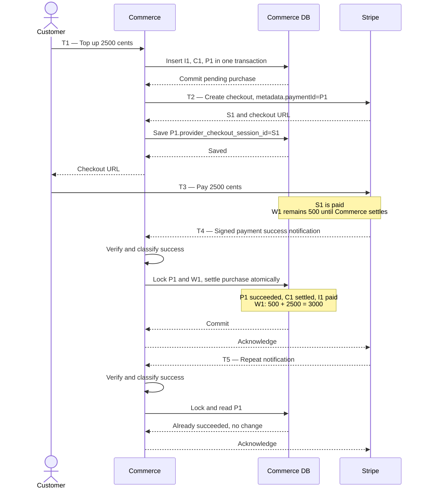

# Top-up: records and payment flow

**$5 wallet + $25 top-up = $30.** Illustrative IDs and values; fields use cents.
Successful manual payment, no concurrent spending. Source snapshot: Commerce
`13e721ea`, not a live payment; recheck before claiming current behavior.

## Shapes and roles

Commerce owns the four database records; Stripe owns the checkout session.

| Record | Role | Relevant shape |
| --- | --- | --- |
| W1 — `commerce_wallets` | Spendable money | `{id, balance_cents}` |
| P1 — `commerce_payments` | Collection attempt | `{id, amount_cents, status, wallet_transaction_id, provider_checkout_session_id}` |
| C1 — `commerce_wallet_transactions` | Purchased wallet credit | `{id, wallet_id, invoice_id, amount_cents, status}` |
| I1 — `commerce_invoices` | Customer's purchase document | `{id, total_amount_cents, total_paid_amount_cents, payment_status}` |
| S1 — Stripe Checkout | Collects the card payment | `{id, payment_status, metadata.paymentId}` |

## Relationships once checkout exists

```text
Stripe S1 ──metadata.paymentId──────────▶ Payment P1
Stripe S1 ◀─provider_checkout_session_id─ Payment P1
                                             │ wallet_transaction_id
                                             ▼
                                          Credit C1
                                          /       \
                                 wallet_id         invoice_id
                                    ▼                  ▼
                                Wallet W1          Invoice I1
```

[Creation](https://github.com/boxlite-ai/boxlite-commerce/blob/13e721eafcf9affd79b7e4f5b219cd2c39ba7eaa/src/wallets/services/top-up-wallet.ts#L62-L100)
and [Stripe metadata](https://github.com/boxlite-ai/boxlite-commerce/blob/13e721eafcf9affd79b7e4f5b219cd2c39ba7eaa/src/payments/provider/stripe/stripe-provider.ts#L172-L195).

## State immediately before each step

T1–T5 express event order.

| Before | W1 balance | P1 amount / status | C1 amount / status | I1 total / paid / payment status | S1 payment status |
| --- | --- | --- | --- | --- | --- |
| T1 — save request | `500` | Absent | Absent | Absent | Absent |
| T2 — create checkout | `500` | `2500 / pending` | `2500 / pending` | `2500 / 0 / pending` | Absent |
| T3 — customer pays | `500` | `2500 / pending`, session=S1 | `2500 / pending` | `2500 / 0 / pending` | `unpaid`, metadata→P1 |
| T4 — apply verified success | `500` | `2500 / pending`, session=S1 | `2500 / pending` | `2500 / 0 / pending` | `paid` |
| T5 — duplicate notification | `3000` | `2500 / succeeded`, session=S1 | `2500 / settled` | `2500 / 2500 / succeeded` | `paid` |

## Interactions across T1–T5



**Credit once.** This flow does not supply the customer's total card balance.
[Settlement](https://github.com/boxlite-ai/boxlite-commerce/blob/13e721eafcf9affd79b7e4f5b219cd2c39ba7eaa/src/wallets/services/settle-top-up.ts#L46-L139)
and [invoice payment fields](https://github.com/boxlite-ai/boxlite-commerce/blob/13e721eafcf9affd79b7e4f5b219cd2c39ba7eaa/src/invoices/repositories/credit-invoice.repository.ts#L235-L248).
