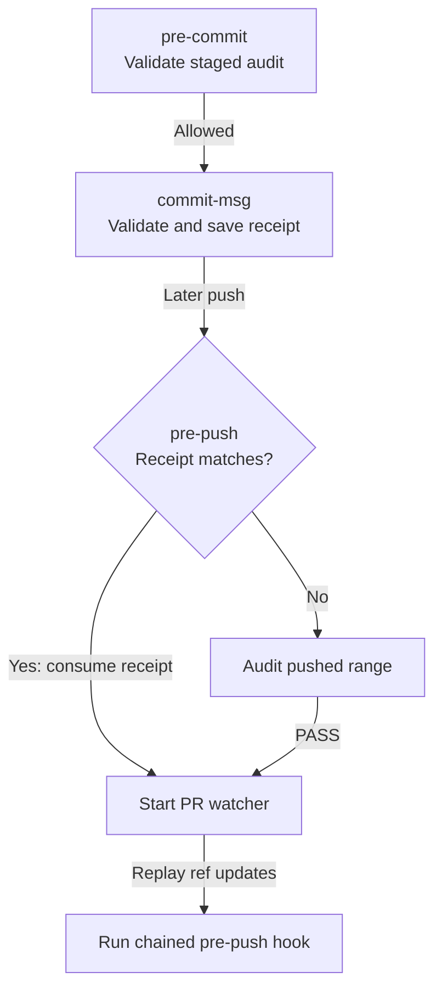

## TL;DR

Git hooks verify installation, gate agent commits and pushes, and keep consumer tooling synchronized across Git lifecycle events.

## Installation and scope

The consumer's `./.agent-tooling/install.sh` calls [setup.sh](../scripts/setup.sh),
which sets worktree-local `core.hooksPath` to this directory. Inspect it with
`git config --worktree --get core.hooksPath` from the consumer checkout.

Audit enforcement detects nonempty `CLAUDECODE`, `CODEX_SANDBOX`, or `AGENT_GATED`.
Installation and guidance checks on commit/push, chained hooks, and watcher setup
also run for humans. These local hooks are workflow checks, not a security sandbox.

## Hooks

| Hook | Input | Behavior |
| --- | --- | --- |
| [pre-commit](pre-commit) | Git invokes without arguments. | Verify installation/guidance, run the existing hook, then validate the final staged index against the agent's audit. |
| [commit-msg](commit-msg) | Commit-message file path. | Run the existing hook; validate the audited subject and staged content, publish a commit receipt, and consume audit state. |
| [pre-push](pre-push) | Remote name/URL; ref updates on stdin. | Verify installation/guidance; audit pushed content or consume a matching receipt, start watchers, then replay input to the existing hook. |
| [post-checkout](post-checkout) | Previous/new HEAD and checkout flag. | Synchronize installation, then forward arguments to the existing hook. |
| [post-merge](post-merge) | Squash flag. | Synchronize installation, then forward arguments to the existing hook. |
| [post-rewrite](post-rewrite) | Rewrite command; old/new commit pairs on stdin. | Preserve stdin, synchronize installation, then replay the pairs and arguments to the existing hook. |

Existing hooks are resolved beneath `git rev-parse --git-common-dir` in `hooks/`;
this avoids resolving `core.hooksPath` back to the same hook. A chained hook's
failure propagates. Lifecycle synchronization is best effort; commit/push
installation verification fails closed.

## How it works

For an agent committing and pushing one change:



Installation and guidance checks run before commit/push audit enforcement.
A failed audit blocks the operation; a receipt only covers a push introducing
exactly the audited commit, matching its parent, tree, and subject. After the
chained hook succeeds (or is absent), the push may proceed.

`pre-push` starts the watcher before transfer; the watcher waits for the commit
and PR to appear remotely. Watcher startup is best effort and also applies to
human pushes. `BOXLITE_PR_WATCH=0` disables startup.
See [watch delivery](../.agents/watch/consumer-lifecycle.md) and
[Git audit contracts](../ARCHITECTURE.md#git-gates).

## Tests

Run from the repository root:

```sh
bash plugins/boxlite-agent-tooling/.githooks/githooks.test.sh
bash plugins/boxlite-agent-tooling/.githooks/lifecycle.test.sh
```

The first suite covers gates, receipts, chaining, and push input; the second covers
installation synchronization during checkout, merge, and rewrite.
