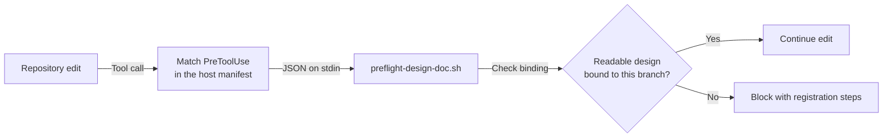

## TL;DR

These manifests connect Claude Code and Codex lifecycle events to the shared hook scripts.

## Manifests

| File | Loaded by | Host differences |
| --- | --- | --- |
| [hooks.json](hooks.json) | Claude Code convention | Uses `asyncRewake`; includes `StopFailure`, `PostToolUseFailure` and managed `AskUserQuestion` hooks. |
| [codex-hooks.json](codex-hooks.json) | Generic and Codex plugin manifests | Uses `async`; omits Claude-only events and questions. |

Commands resolve the plugin directory through `${PLUGIN_ROOT:-${CLAUDE_PLUGIN_ROOT}}`.
Implementations live in [`.agents/hooks/`](../.agents/hooks/README.md);
[Git hooks](../.githooks/README.md) are installed separately.

## How it works

For an explicit editor or patch call targeting repository files:



The host resolves the plugin root and interprets the hook's result. Shell hooks
use the same dispatch mechanism but inspect their own command text; a `Bash`
matcher alone does not distinguish `git commit` from an unrelated command.

## Event routing

| Event / matcher | Scripts in manifest order |
| --- | --- |
| `UserPromptSubmit` | [cancel-verdict-audit.sh](../.agents/hooks/cancel-verdict-audit.sh) |
| `SubagentStart`, `SubagentStop` | [auditor-control.sh](../.agents/hooks/auditor-control.sh) |
| `PreToolUse` / editor or patch tools | [preflight-design-doc.sh](../.agents/hooks/preflight-design-doc.sh) |
| `PreToolUse` / `Bash` | [preflight-commit-push.sh](../.agents/hooks/preflight-commit-push.sh), [preflight-pr-review.sh](../.agents/hooks/preflight-pr-review.sh) |
| `PreToolUse`, `PostToolUse` / `AskUserQuestion` (Claude) | [claude-timed-question.sh](../.agents/hooks/claude-timed-question.sh) |
| `PostToolUse` / `Bash` | [post-remote-write-watch.sh](../.agents/hooks/post-remote-write-watch.sh), [record-test-run.sh](../.agents/hooks/record-test-run.sh) |
| `PostToolUseFailure` / `Bash` (Claude) | [record-test-run.sh](../.agents/hooks/record-test-run.sh) |
| `Stop` | [stop-gate.sh](../.agents/hooks/stop-gate.sh) |
| `StopFailure` (Claude) | [record-api-failure.sh](../.agents/hooks/record-api-failure.sh), [resume-after-api-failure.sh](../.agents/hooks/resume-after-api-failure.sh) |

Tool matchers select tool names; the scripts inspect commands themselves.
For example, a `Bash` call running `git commit` reaches the commit gate,
while an unrelated shell command passes through.

[rule-recency.sh](../.agents/hooks/rule-recency.sh) is opt-in through the consumer
templates; neither plugin manifest wires it. Audit runners are called by gates
or shell callers, rather than registered as lifecycle hooks.

## Validation

Run from the repository root after changing either manifest:

```sh
bash plugins/boxlite-agent-tooling/host-parity.test.sh
bash plugins/boxlite-agent-tooling/architecture.test.sh
```

Parity checks cover event support, command paths, host differences, and plugin
registrations. They do not prove installation or live event delivery on a host.
