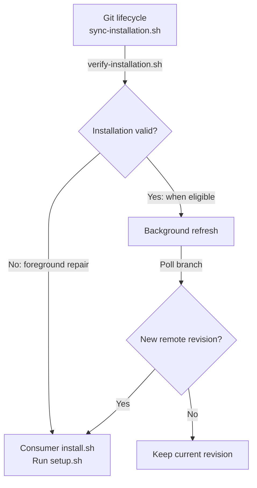

## TL;DR

These commands manage consumer installation, design registration, audit history, timed confirmations, and recovery for unattended Claude runs.

## Running commands

Use `bash <plugin-root>/scripts/<script>`; `<plugin-root>` is the parent of
`scripts/`. Commands without a repository argument generally use the current
checkout. Consumer installation starts with `./.agent-tooling/install.sh`;
the [bootstrap templates](../../../templates/) supply that entry point.

Dependencies vary by command: Bash, Git, `jq`, and Perl cover shared operations;
provider access and recovery additionally use `gh`, `curl`, or `claude`.
Keep provider credentials in environment variables.

## How it works

The scripts provide command-line boundaries around shared libraries or coordinate
installation. For example, a checkout triggers this maintenance path:



Refresh honors holds, interval checks, and a lock. Lifecycle-triggered installs
defer committed guidance edits. Explicit installation updates those instructions;
`setup.sh` validates the profile and configures hooks. Verification stays local
and works offline.

Design, audit-history, and confirmation commands are separate entry points. Their
wrappers validate arguments and dependencies, then call libraries under
[`../.agents/lib/`](../.agents/lib/); the libraries own provider reads and state transitions.

## Installation and guidance

| Script / arguments | Responsibility and effects |
| --- | --- |
| [validate-profile.sh](validate-profile.sh) `<repository-root>` | Validate the consumer profile, origin identity, host activation declarations, and required tools; reject invalid setup. |
| [setup.sh](setup.sh) `[repo-root]` | Validate the profile, synchronize instructions, and configure worktree-local Git hooks. The installer owns revision adoption. |
| [verify-installation.sh](verify-installation.sh) `[repo-root]` | Check the recorded revision, hold, cache, and hook path locally; report stale refresh locks without removing them. |
| [sync-installation.sh](sync-installation.sh) | Git lifecycle entry point: repair broken adoption in the foreground, otherwise schedule a throttled background refresh. Failures do not block lifecycle events. |
| [refresh-installation.sh](refresh-installation.sh) `[repo-root]` | Under a refresh lock, ask the consumer installer to adopt the configured branch; honor holds and report refresh results. |
| [sync-guidance.sh](sync-guidance.sh) `[--check\|--check-current\|--force] [repo-root]` | Splice canonical workflow into consumer instructions. `--check` validates integrity; `--check-current` also rejects stale content; `--force` permits updating modified instruction files. |
| [check-writing-ownership.sh](check-writing-ownership.sh) `[repo-root]` | Check generated guidance and scan repository Markdown for copied rules owned by `boxlite-writing`. |

Lifecycle-triggered installs defer instruction edits. Run the consumer installer
explicitly to update committed guidance. Lifecycle events attempt background
refresh at most once every 15 minutes; `AGENT_TOOLING_REFRESH=0` disables it and
`AGENT_TOOLING_REFRESH_MINUTES` changes the interval.

## Design, review, and audit history

| Script / arguments | Responsibility and effects |
| --- | --- |
| [design-doc.sh](design-doc.sh) `bind <URL>` or `check` | Fetch and validate a design; bind it to the current worktree/branch or recheck the existing binding. |
| [pr-author-review.sh](pr-author-review.sh) `<github-event.json>` | CI publisher: update the author-review check and prompt, and return an unacknowledged PR to draft. Exit 0: acknowledged/irrelevant; 1: awaiting acknowledgment; 2: API/validation error. |
| [audit-reflection.sh](audit-reflection.sh) `prepare\|record\|status\|submit STATE` | Read bounded request JSON from stdin; validate and persist audit-cycle transitions, returning cycle JSON on stdout. |
| [audit-reflection-gate.sh](audit-reflection-gate.sh) `CONTEXT OPERATION [ATTEMPT_ID]` | Adapt audit history to scoped gates: validate context, snapshot evidence, and reconcile outcomes; payload JSON arrives on stdin. |

From a consumer checkout, `bash <plugin-root>/scripts/design-doc.sh check`
revalidates its registered design. Registration and provider authentication are
documented in [Contributing](../CONTRIBUTING.md#pull-request-descriptions).

Native auditors use the [audit-history procedure](../.agents/prompts/audit/git-audit-history.md).
History CLI context is JSON containing `repo_root`, `session`, `epoch`, `branch`,
and `gate`; use the prescribed operations instead of editing state files.
See [state contracts](../ARCHITECTURE.md#state-files) and the
[author-review workflow](../../../.github/workflows/author-review.yml).

## Confirmations and recovery

| Script / arguments | Responsibility and effects |
| --- | --- |
| [timed-user-prompt.sh](timed-user-prompt.sh) `request\|status\|respond\|renew\|consume\|fallback STATE SPEC_OR_ID [HUMAN_TEXT]` | Persist confirmation deadlines, exact human responses, consumption, and expiry; renewal requires the user's explicit instruction. |
| [claude-with-timed-prompts.sh](claude-with-timed-prompts.sh) `[claude args...]` | Launch Claude with this plugin; configure native question timeout for supported local sessions and disable Remote Control there. |
| [continue-timed-prompts.sh](continue-timed-prompts.sh) | Called by the Stop gate with hook JSON on stdin; emit a continuation for pending confirmations or their timeout fallback. |
| [resume-on-network-error.sh](resume-on-network-error.sh) `[--max-restarts N] [--max-wait SECONDS] [--probe-url URL] [--] <prompt> [claude args...]` | Supervise `claude -p`, retry eligible API failures within budgets, and print final result JSON. |

The recovery wrapper needs [record-api-failure.sh](../.agents/hooks/record-api-failure.sh)
and a matching `CLAUDE_PROJECT_DIR`. Defaults allow 50 restarts and six hours of
total waiting; unknown failure kinds get a smaller budget. Run it with `--help`
for exit codes. Interactive recovery uses a separate
[StopFailure hook](../.agents/hooks/resume-after-api-failure.sh).

See [timed confirmations](../ARCHITECTURE.md#timed-confirmations) for supported
host modes and response rules.

## Tests

Run suites from the repository root, for example:

```sh
bash plugins/boxlite-agent-tooling/scripts/design-doc.test.sh
bash plugins/boxlite-agent-tooling/scripts/sync-guidance.test.sh
bash plugins/boxlite-agent-tooling/scripts/refresh-installation.test.sh
```

Most commands have adjacent `*.test.sh` suites. Installation also uses
[template tests](../../../templates/install.test.sh) and
[Git lifecycle tests](../.githooks/lifecycle.test.sh). `audit-history-*.test.sh`,
`audit-reconciliation.test.sh`, and `audit-reflection-*.test.sh` cover shared
history behavior; `claude-timed-*.test.sh` cover launcher and question integration.
`fixtures/` contains test helpers, not operator commands.
